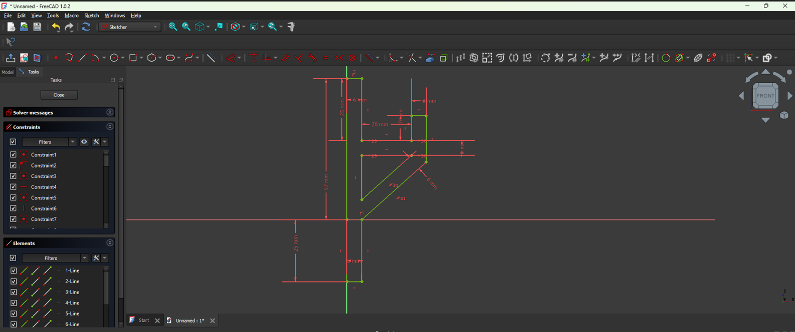
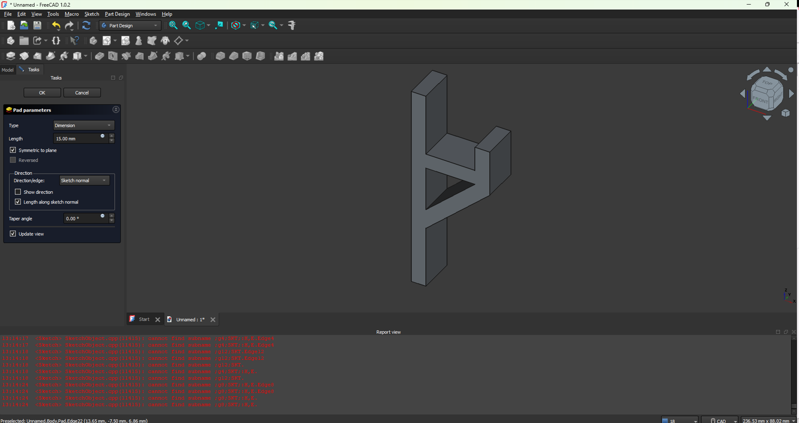
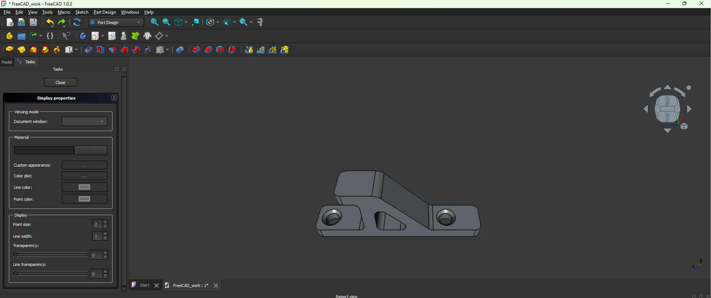
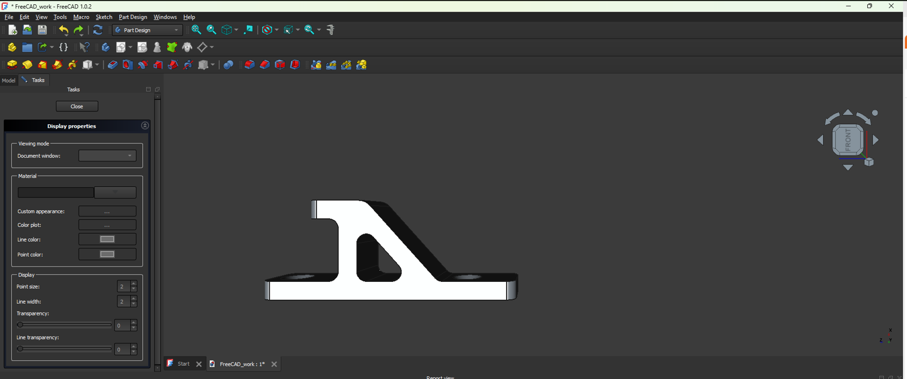
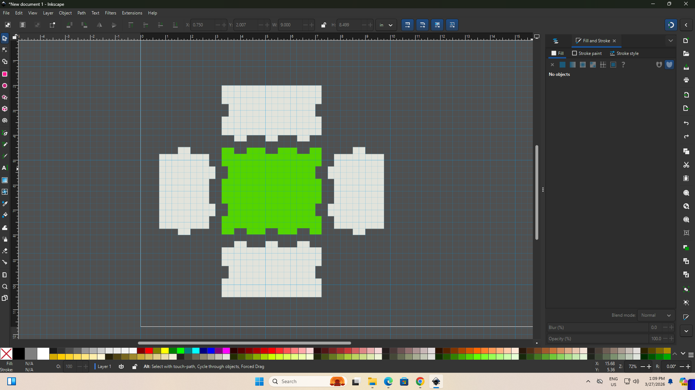
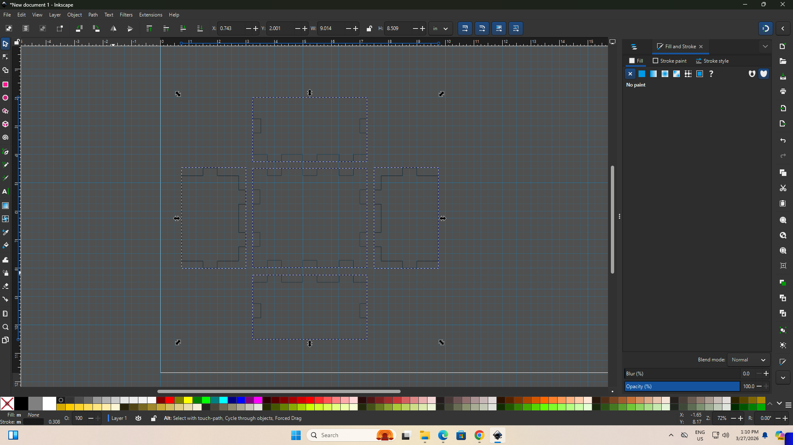

# Day 2: Digital Modeling for Fabrication - Activity 1 (FreeCAD)

## Overview
Day 2 emphasized the link between CAD decisions and fabrication reliability. In this activity, I recreated an L-shaped mounting bracket in FreeCAD by following a feature-based workflow suitable for manufacturing.

This section documents only **Activity 1** from the official after-class guide. The existing Activity 2 documentation is kept below without modification.

## Objective of Activity 1
The objective was to model a clean and fabrication-oriented **L-shaped mounting bracket** in 3D, and demonstrate the required operations:

- **Sketch** to define the 2D profile.
- **Pad** to generate 3D volume from the sketch.
- **Hole** to add two fastening holes.
- **Fillet** to round one corner and improve geometry quality.

## Activity 1 Requirements (Guide Alignment)
From the official Day 2 guide, the model should clearly show:

- An L-shaped solid part.
- Two flat faces at 90 degrees.
- Two round holes for screws/bolts.
- Simple geometry without complex curves.
- Clean edges with one rounded (filleted) corner.

## Tools and Software Used
- **FreeCAD 1.0.2** (Part Design and Sketcher workbenches).
- Built-in feature tools: Sketch, Pad, Hole, and Fillet.

## Step-by-Step Process
1. **Interpreted the target geometry**
   I first reviewed the expected bracket characteristics from the Day 2 instructions so the model stayed within the required scope: a simple L-profile, two holes, and one filleted edge.

2. **Created and constrained the 2D sketch**
   In Sketcher, I drew the bracket profile and applied dimensional/geometric constraints to control lengths, offsets, and angles. This made the base geometry stable before creating any 3D features.

3. **Converted the sketch into a 3D part with Pad**
   I switched to Part Design and used **Pad** to extrude the constrained sketch into a solid body. At this stage, the part had the required 90-degree form and overall bracket volume.

4. **Added mounting holes**
   I introduced two round holes at the fastening zones to match the assignment requirement for screw/bolt accommodation.

5. **Applied edge fillet and finalized the part**
   I rounded one corner with **Fillet** to satisfy the final geometric requirement and improve edge quality in the final model.

## Design Evolution

### 1. Sketching Phase

*Figure 1. Constrained 2D sketch used as the base definition for the bracket profile.*

### 2. Base Model Without Holes

*Figure 2. Initial padded body showing the primary bracket shape before hole operations.*

### 3. After Adding Holes

*Figure 3. Two circular mounting holes added to support fastening functionality.*

### 4. Final Result

*Figure 4. Final model with clean geometry and rounded edge, ready for fabrication-oriented review.*

## Challenges and Solutions

### Challenge 1: Maintaining stable sketch behavior while editing dimensions
**Solution:** I applied constraints progressively and checked solver feedback after each change to avoid over-constraint and maintain a robust parametric sketch.

### Challenge 2: Preserving design simplicity while meeting all required features
**Solution:** I followed the assignment sequence strictly (Sketch -> Pad -> Hole -> Fillet) and avoided unnecessary complex features.

### Challenge 3: Getting clean final edges and readable geometry
**Solution:** I applied fillet only after core features were complete, which reduced feature conflicts and preserved a clean final topology.

## Results and Observations
- I produced a complete L-shaped bracket model aligned with the official Activity 1 requirements.
- The final part includes the expected 90-degree faces, two round holes, and one filleted corner.
- This exercise reinforced that robust sketches are critical because downstream features depend directly on early geometric constraints.
- I also observed that sequencing operations correctly improves model stability and reduces rework.

## Downloadable Files
For reproducibility, the FreeCAD source file is available here:

- [FreeCAD Activity 1 model (FCStd)](../images/day_2/FreeCAD_work.FCStd)

Original working directory used during modeling:

- `C:\Users\EA\Videos\EA\benjamin\FreeCAD_work`

---

# Day 2: Digital Modeling for Fabrication

## Overview
Day 2 focused on the relationship between digital geometry and fabrication reliability. The core lesson was that a model is not only a visual artifact; it is a production instruction set for machines that execute geometry exactly as defined.

For the after-class assignment, two activities were proposed in the official guide. This documentation intentionally focuses on **Activity 2** only (Inkscape vector modeling for a press-fit design). Activity 1 (FreeCAD L-bracket) will be documented separately.

## Objective of Activity 2
The objective of this activity was to produce a fabrication-ready Inkscape vector design for a press-fit panel, with direct attention to manufacturing accuracy and file-readiness for laser cutting.

The specific targets were to:

- Create a fabrication-ready 2D vector design in Inkscape for a press-fit box panel workflow.
- Maintain **1:1 real-world scale** and dimension accuracy throughout the design process.
- Produce **clean, machine-readable vector paths** suitable for laser cutting.
- Size slots using material-thickness logic so parts can slide and lock during assembly.
- Export production-ready files for downstream fabrication.

## Official Activity 2 Requirements (Guide Alignment)
According to the Day 2 guide, Activity 2 requires students to model a **Press-Fit Box Panel (2D Vector)** in Inkscape and recognize the following characteristics:

- A flat rectangular panel.
- Rectangular slots cut into panel edges.
- Slot widths matched to material thickness.
- Geometry intended to slide and lock with other panels.
- Entirely 2D vector construction.

The guide emphasizes three quality criteria:

- **1:1 scale** for real dimensions.
- **Clean paths** for precise cutting behavior.
- **Slot accuracy** for functional press-fit assembly.

## Tools Used
- **Inkscape** (2D vector design and path editing).
- **Laser-cut workflow conventions** (stroke color and thin cut-line thickness).
- **Output formats:** SVG (editable master) and PDF (machine handoff format used in the workflow).

## Design Process

### Design Intent and Parametric Thinking
Although the official task highlights a single press-fit panel, I implemented an extended panel-set workflow (tabbed box layout) to validate fit logic under realistic assembly conditions. The same principles apply directly to a single panel: controlled dimensions, slot precision, and clean vectors.

The process began from nominal panel dimensions, then added tabs/slots as controlled geometric operations. This follows digital fabrication best practice: define predictable baseline geometry first, then apply feature operations with repeatable logic.

### Step-by-Step Implementation
1. **Set document units and work area**
   - Opened Document Properties in Inkscape.
   - Set units to **inches** and configured a **24 in x 24 in** working page.
   - Established a rectangular grid for accurate snapping and repeatability.

2. **Configure design grid for fabrication logic**
   - Grid spacing set to **0.25 in** in X and Y.
   - Grid used as a construction reference to maintain consistent tab/slot increments.

3. **Create nominal panel rectangles (base geometry)**
   - Drew base faces using exact typed dimensions rather than freehand drag-only sizing.
   - Example nominal sizes from the workflow:
     - End panel: **2 in x 3 in**
     - Side panel: **2 in x 4 in**
     - Bottom/Top reference panel: **3.5 in x 4 in**

4. **Create tabs using additive vector operations**
   - Built a prototype tab rectangle (**0.5 in x 0.5 in**).
   - Duplicated and positioned tab rectangles at required edges.
   - Applied **Path > Union** to merge tab shapes with the target panel outline.

5. **Create slots using subtractive vector operations**
   - Duplicated tabbed geometry as a temporary cutter/stamper profile.
   - Aligned cutter profile to mating panel edges.
   - Applied **Path > Difference** to subtract matching slot voids.
   - Repeated with mirror/rotation operations to maintain edge compatibility.

6. **Use transformation controls for mating consistency**
   - Applied rotate and flip operations (90-degree rotation, vertical/horizontal flips) to reuse validated cutter geometry.
   - This reduced manual redrawing errors and improved dimensional coherence across mating edges.

7. **Duplicate required faces for assembly set completeness**
   - Replicated symmetrical parts (e.g., second side/end where needed).
   - Organized parts efficiently on the sheet for fabrication layout.

8. **Apply laser-cut line conventions**
   - Removed fills and retained stroke-only geometry.
   - Set strokes to red and applied thin cut-line width (workflow value: **0.001 in**).
   - Verified visual faintness as expected for machine-targeted line thickness.

9. **Export production files**
   - Saved editable source as **SVG**.
   - Exported fabrication handoff as **PDF**.

### Process Evidence from Inkscape

#### Step Evidence 1: Base geometry and slot construction setup
The first screenshot captures the stage where base panel geometry, grid-aligned dimensions, and early tab/slot construction logic were established. This phase is critical because all later Boolean operations (Union and Difference) depend on accurate geometric alignment.

#### Step Evidence 2: Refined cut geometry and fabrication preparation
The second screenshot shows the refinement stage where interlocking boundaries are cleaned, geometry is validated for machine interpretation, and the design is prepared for export. At this point, stroke-only cut intent and path consistency are checked before final output generation.

## Design and Fabrication Considerations

### 1) Precision Modeling and Scale Control
From the Day 2 digital modeling material, one critical rule is that fabrication machines do not infer intent; they execute dimensions exactly. Therefore, all geometry was maintained at 1:1 scale and entered numerically.

### 2) Design for Manufacturing (DFM)
The model was intentionally kept simple and manufacturable:

- Planar 2D geometry only.
- Reusable tab logic for predictable assembly.
- Feature dimensions tied to stock thickness assumptions.

This reflects the DFM principle: design what can be produced reliably, not only what looks correct on screen.

### 3) Geometry Integrity for Laser Cutting
The file was prepared as clean vector paths with deliberate path operations (Union/Difference) to avoid ambiguous overlaps. For 2D digital fabrication, path clarity directly affects toolpath interpretation and cut quality.

### 4) Tolerances and Fit Strategy
Digital geometry is ideal; physical fabrication is not. Press-fit performance is influenced by:

- Material thickness variation.
- Kerf (material removed by the laser).
- Minor machine and alignment deviations.

Slots were therefore designed with thickness-fit logic and intended for validation cuts before final production.

## Final Results
The final output of Activity 2 is a fabrication-ready 2D vector design that satisfies the official press-fit modeling criteria:

- Accurate 1:1 dimensioned geometry.
- Slot-enabled panel edges for interlocking assembly.
- Clean vector paths suitable for laser toolpath generation.
- Exported files for both editing and machine workflow:
  - SVG (source/editable)
  - PDF (production handoff)

### Final Design Files
- [Download final SVG design](../images/day_2/final_design.svg)
- [Download final PDF output](../images/day_2/final_design.pdf)

These files are organized in the Day 2 image asset directory to keep source documentation and fabrication outputs versioned within the MkDocs project.

## Observations and Challenges

### Challenge 1: Maintaining exact slot alignment on multiple edges
**Solution:** Reused validated tab geometry as cutter profiles and applied rotate/flip transformations rather than redrawing each slot manually.

### Challenge 2: Preventing vector ambiguity before fabrication
**Solution:** Used explicit path operations (Union/Difference) and removed fill color to inspect stroke-only cut boundaries.

### Challenge 3: Converting digital dimensions into reliable physical fit
**Solution:** Designed with material-thickness assumptions and prepared for iterative tolerance calibration (test cuts and slot adjustments).

## Key Learnings and Reflection
This activity reinforced that successful digital fabrication depends on disciplined modeling decisions made before any machine operation begins. Three insights were especially important:

1. **Model precision is non-negotiable**: dimensional errors in design become physical errors in fabrication.
2. **Vector cleanliness is a manufacturing requirement**: unclear paths produce unreliable cuts.
3. **Fit is an engineering variable**: kerf and material behavior must be considered as part of design, not as post-process corrections.

Overall, Activity 2 strengthened my ability to connect CAD intent, manufacturing constraints, and file-preparation standards into a coherent fabrication workflow.

## Documentation Status
Activity 1 is now documented at the top of this page. The Activity 2 section above remains as previously completed.