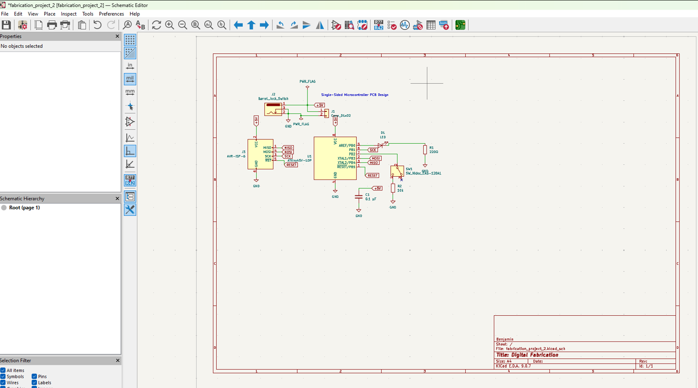
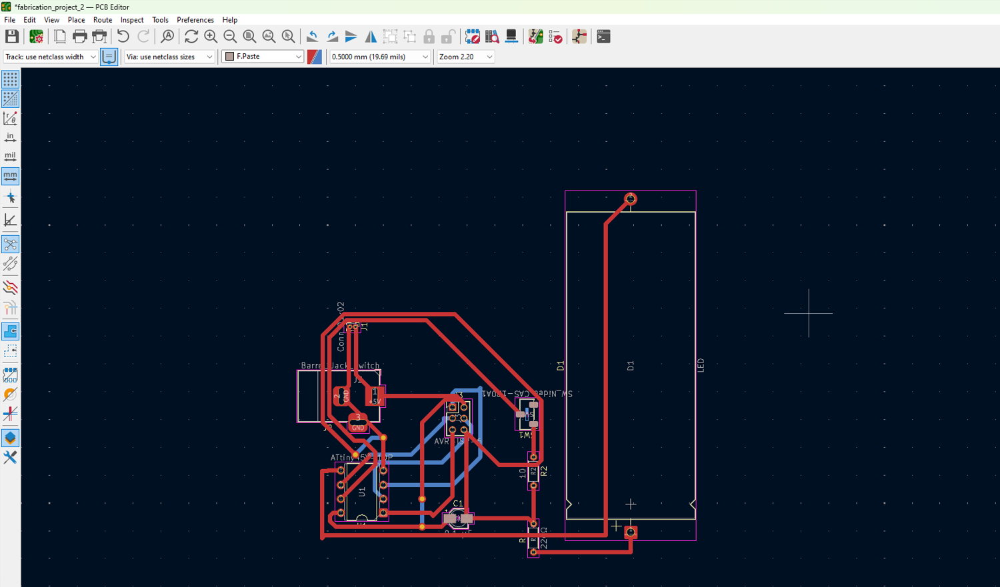
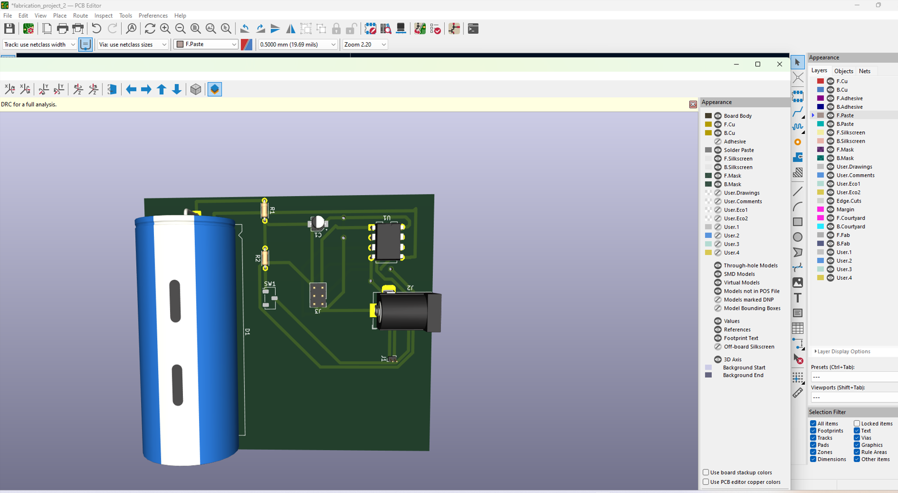
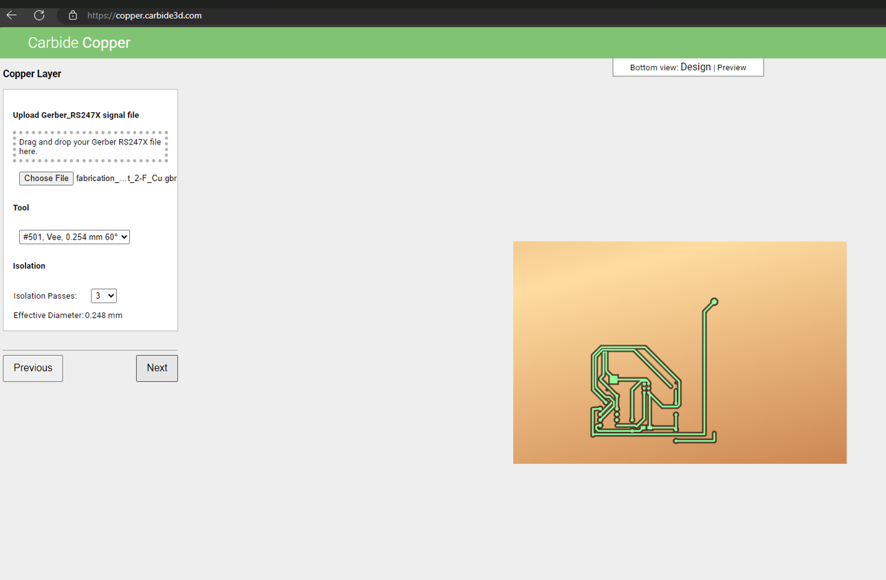
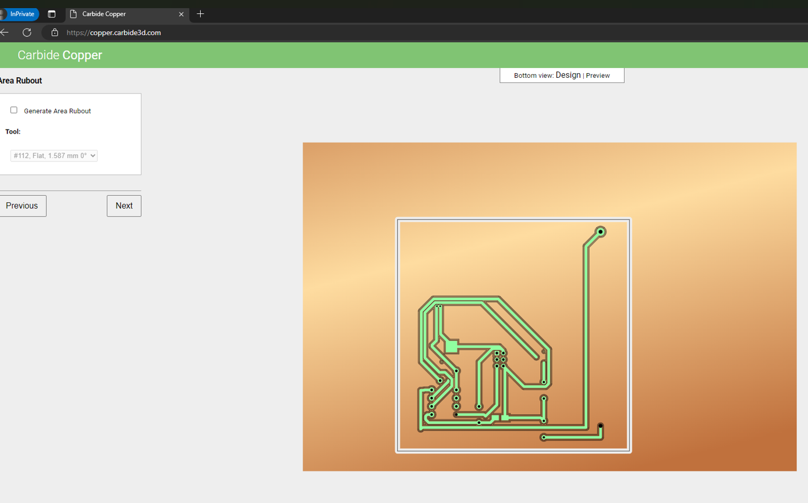
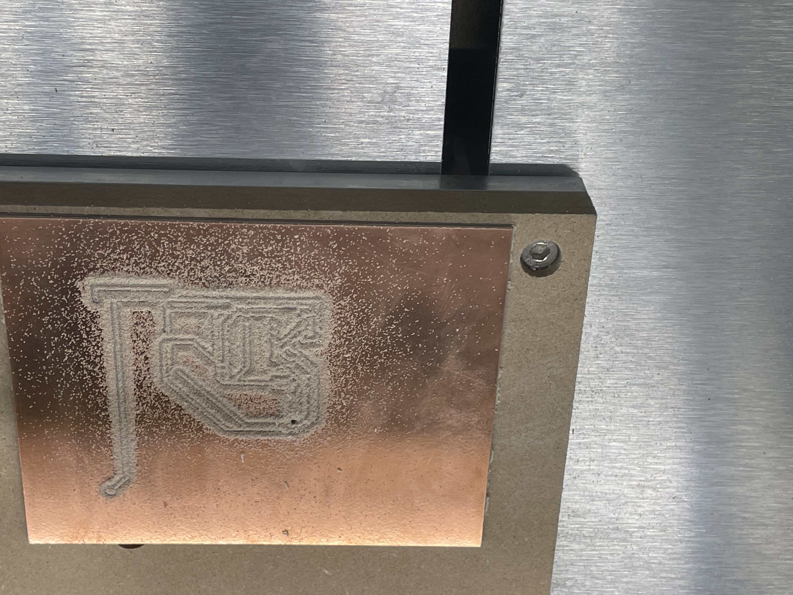
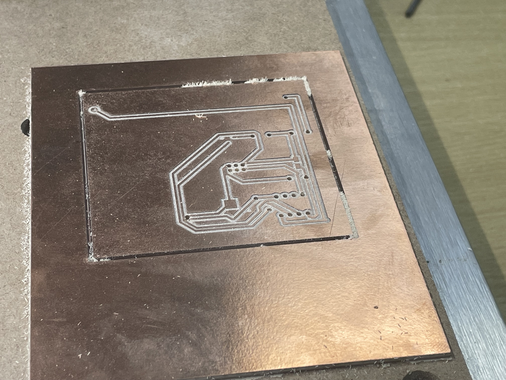
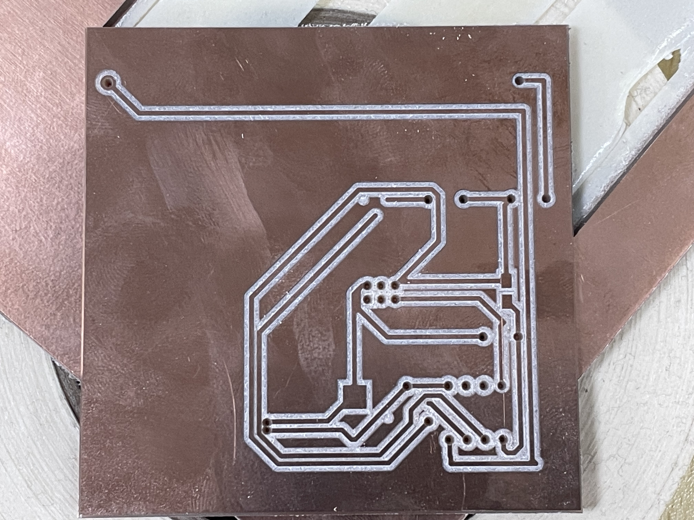

# Day 3 – PCB Design and Fabrication

## Introduction

This laboratory session focused on the complete workflow of translating a microcontroller-based embedded circuit into a fabrication-ready printed circuit board (PCB) using computer-aided design and subtractive manufacturing techniques. The exercise integrated multiple critical phases of the digital fabrication process: schematic capture, component placement and routing, design rule verification, Gerber file generation, toolpath planning, and desktop CNC milling.

The primary objective was to design and fabricate a functional ATtiny45-based control circuit while adhering to the practical constraints inherent in PCB milling processes. These constraints include maintaining adequate trace widths for tool clearance, ensuring sufficient isolation gaps between conductors, prioritizing through-hole components for ease of assembly, and creating a layout optimized for single-sided fabrication. This approach reflects real-world manufacturing considerations where design decisions must balance electrical functionality with fabrication feasibility.

## Objectives

1. Design and document a complete single-sided microcontroller PCB using KiCad, ensuring all electrical connections are properly defined and annotated.
2. Establish a clear pin mapping and net structure where each component serves a defined functional purpose within the embedded system architecture.
3. Optimize the PCB layout for subtractive manufacturing by maintaining appropriate trace widths, clearances, and component spacing compatible with desktop CNC milling capabilities.
4. Generate and validate Gerber fabrication files through the Carbide Create toolpath verification workflow to identify potential manufacturing issues before machining.
5. Execute the complete fabrication process on the Nomad 3 CNC mill and evaluate the physical board quality against design specifications.

## Tools and Materials

### Hardware and Equipment

- **Nomad 3 CNC Mill**: Desktop precision milling machine used for copper isolation routing and board contour cutting
- **Copper-clad FR-1 substrate**: Single-sided phenolic laminate board material serving as the base for PCB fabrication
- **Through-hole electronic components**: Including ATtiny45 microcontroller, resistors, capacitors, LED, push button, and ISP header
- **Soldering station and accessories**: Temperature-controlled soldering iron, solder wire, flux, desoldering braid
- **Measurement and inspection tools**: Digital multimeter for continuity testing, calipers for dimensional verification, magnifying lens for trace inspection

### Software Tools

- **KiCad 7.x**: Open-source electronics design automation suite used for schematic capture, footprint library management, PCB layout design, design rule checking, and Gerber file generation
- **Carbide Create / Carbide Copper**: CAM software for PCB milling toolpath generation, isolation routing verification, and machine code preparation
- **Carbide Motion**: Machine control software for Nomad 3 CNC operation, tool zeroing, and fabrication execution

## Methodology

### Phase 1: Schematic Capture and Circuit Definition

The design process began with formal circuit documentation in KiCad's schematic editor rather than proceeding directly to PCB layout. This approach ensures electrical correctness is verified before physical routing constraints are introduced. The circuit architecture centers on an ATtiny45 microcontroller configured with the following functional blocks:

**Power Supply System:**  
A 5V DC power input is distributed through a dedicated power connector. A 0.1 µF ceramic decoupling capacitor is placed directly across the VCC and GND pins of the microcontroller to suppress high-frequency noise and stabilize the local power supply. This capacitor placement follows standard PCB design practices for digital integrated circuits, where the decoupling element must be positioned as close as possible to the power pins to minimize parasitic inductance.

**Output Subsystem:**  
Pin PB0 of the ATtiny45 is configured as a digital output driving an LED indicator through a current-limiting resistor. The resistor value was calculated using Ohm's law to maintain LED current within safe operating limits (typically 10-20 mA) based on the forward voltage drop of the LED and the 5V supply voltage. A 220 Ω resistor was selected to provide approximately 15 mA of current, assuming a 2V forward voltage drop across the LED.

**Input Subsystem:**  
Pin PB2 serves as a digital input connected to a push-button switch. The button is configured with an external pull-up or pull-down resistor (depending on the desired logic level) to ensure a defined logic state when the button is not pressed. This prevents floating input conditions that could cause unpredictable behavior.

**Programming Interface:**  
A 6-pin ISP (In-System Programming) header exposes the necessary signals for programming the ATtiny45 after PCB fabrication. The standard ISP interface includes:

- **MOSI** (Master Out Slave In): Data line from programmer to microcontroller
- **MISO** (Master In Slave Out): Data line from microcontroller to programmer  
- **SCK** (Serial Clock): Clock signal for synchronous communication
- **RESET**: Active-low reset line required to enter programming mode
- **VCC** and **GND**: Power supply connections for the programmer interface

This ISP arrangement follows the standard AVR programming protocol and ensures compatibility with common programmers such as USBasp, AVR Dragon, or Arduino-as-ISP configurations.

**Pin Assignment Strategy:**

The ATtiny45 pin configuration was carefully planned to minimize routing complexity:

| Pin Number | Pin Name | Function | Description |
|------------|----------|----------|-------------|
| 1 | RESET/PB5 | ISP Programming | Reset line with 10kΩ pull-up resistor |
| 2 | PB3 | ISP Programming | Programming clock (SCK) |
| 3 | PB4 | ISP Programming | Programming data (MISO) |
| 4 | GND | Power | Ground reference |
| 5 | PB0 | LED Output | Digital output with current-limiting resistor |
| 6 | PB1 | ISP Programming | Programming data (MOSI) |
| 7 | PB2 | Button Input | Digital input with pull-up configuration |
| 8 | VCC | Power | 5V power supply |

This pin assignment minimizes trace crossings on a single-sided board by grouping related functions (power, programming, I/O) in adjacent physical locations on the IC package.

**Design Rationale:**

The decision to maintain a single-sided, through-hole design was driven by three primary considerations:

1. **Fabrication Compatibility**: Single-sided boards eliminate the need for vias and plated through-holes, which are not available in standard PCB milling workflows. All traces can be routed on the copper layer without requiring double-sided alignment or conductive via filling.

2. **Assembly Accessibility**: Through-hole components provide larger solder pads and longer component leads, making manual soldering significantly more reliable than fine-pitch surface-mount assembly. This is particularly important for prototype development where rework may be necessary.

3. **Design Simplicity**: Restricting the design to one layer forces disciplined routing decisions and results in a more maintainable circuit. The constraint prevents over-complication and ensures that the board layout remains comprehensible during debugging and modification.

*Figure 1. Complete schematic diagram showing electrical connections, component values, and pin assignments. The schematic serves as the authoritative reference for all electrical relationships before physical layout.*

*Figure 2. PCB layout in KiCad editor demonstrating component placement strategy and trace routing. All connections are maintained on the bottom copper layer to support single-sided fabrication.*

*Figure 3. Three-dimensional rendering of the PCB showing component heights, board dimensions, and physical clearances. This visualization confirms mechanical fit before fabrication.*

### Phase 2: PCB Layout and Design Rule Verification

Following schematic completion, the design progressed to the PCB layout phase in KiCad's PCBNew editor. This phase required translating the logical circuit connections into a physical board geometry while respecting both electrical requirements and manufacturing constraints.

**Component Placement Strategy:**

Component placement followed a systematic approach to minimize trace length and routing complexity:

1. **Power Components**: The power connector and decoupling capacitor were placed in close proximity to the microcontroller to minimize supply trace inductance and provide effective power supply filtering.

2. **Microcontroller Central Positioning**: The ATtiny45 was positioned centrally on the board to allow symmetric routing to peripheral components (LED, button, ISP header).

3. **Functional Grouping**: Related components were clustered together—the LED and its current-limiting resistor were placed adjacent to each other, and the ISP header was oriented to provide clear access for programming cable connection.

4. **Mechanical Considerations**: Components were oriented to avoid interference with mounting holes and to ensure adequate clearance for soldering access.

**Routing Methodology:**

The routing process adhered to specific design rules optimized for PCB milling:

- **Trace Width**: Minimum trace width was set to 0.4 mm (15.7 mil) to ensure reliable copper retention during milling. Narrower traces risk being damaged by tool runout or copper adhesion failure.

- **Clearance**: Minimum clearance between traces was maintained at 0.4 mm to provide adequate isolation distance for the milling bit. This spacing accounts for tool diameter (typically 0.1-0.2 mm) plus isolation margin.

- **Via Elimination**: All routing was completed on a single copper layer without vias. Where necessary, zero-ohm resistors or wire jumpers were designated for manual installation during assembly to bridge crossing traces.

- **Ground Pour**: A ground plane was established on unused board areas to minimize etching time and provide a robust ground reference for the circuit.

**Design Rule Checking:**

Before exporting fabrication files, KiCad's Design Rule Check (DRC) was executed to identify any violations:

- **Electrical Rule Violations**: Verified no unconnected nets or short circuits existed
- **Clearance Violations**: Confirmed all copper features maintained minimum separation distance
- **Silkscreen Conflicts**: Ensured component reference designators did not overlap with pads or traces

The DRC process is critical because errors caught in the digital design phase are trivial to correct, whereas physical board errors require complete refabrication.

### Phase 3: Gerber Export and Toolpath Generation

Upon completion of the PCB layout, the design was exported from KiCad in Gerber format (RS-274X standard), the industry-standard file format for PCB manufacturing. The export process generated the following essential files:

- **Copper Layer File (.gbr)**: Contains the complete copper trace geometry
- **Board Outline File (.gbr)**: Defines the physical board perimeter for cutting
- **Drill File (.drl)**: Specifies component hole positions and diameters (Excellon format)
- **Component Position File (.pos)**: Documents component coordinates for assembly reference

These Gerber files were subsequently imported into Carbide Copper, a specialized PCB milling workflow within Carbide Create. This software translates the Gerber vector geometry into CNC toolpaths suitable for subtractive fabrication.

**Toolpath Verification Process:**

The Carbide Copper workflow provided critical pre-fabrication verification:

1. **Isolation Routing Visualization**: The software generated a visual preview showing where the milling tool would remove copper to create electrical isolation between traces. This visualization revealed whether trace spacing was adequate for the selected tool diameter.

2. **Trace Continuity Check**: The preview confirmed that all intended copper connections remained intact after isolation routing, with no inadvertent trace breaks caused by tight spacing or design errors.

3. **Board Outline Validation**: The cutting path for the board perimeter was verified to ensure complete separation from the stock material without damaging internal traces.

This verification step is essential because schematic and PCB layout tools verify electrical correctness but do not account for the physical limitations of milling tools. A design may be electrically valid yet impossible to fabricate if trace spacing is narrower than the tool diameter plus required clearance.

**Fabrication Parameter Selection:**

The following CNC parameters were configured for optimal milling results:

- **Isolation Tool**: 0.1 mm (60° or 90°) V-bit for copper isolation routing
- **Isolation Depth**: 0.1-0.15 mm depth to completely remove copper while minimizing substrate damage
- **Cutting Speed**: 1000-1500 mm/min feed rate balanced between speed and finish quality  
- **Spindle Speed**: 10,000-12,000 RPM for clean copper cutting without melting
- **Number of Passes**: Single isolation pass with optional second pass for wider clearances on critical nets

*Figure 4. Initial toolpath preview in Carbide Copper showing the imported copper geometry. The red areas indicate copper to be removed during isolation routing, while the remaining copper forms the circuit traces.*

*Figure 5. Final toolpath verification confirming adequate trace separation and isolation routing completeness. All copper islands are electrically isolated, and trace continuity is maintained throughout the design.*

### Phase 4: CNC Fabrication on Nomad 3

The final fabrication phase involved translating the verified toolpaths into a physical PCB using the Nomad 3 desktop CNC mill. This subtractive manufacturing process removes unwanted copper from the substrate to create the desired circuit pattern.

**Machine Setup Procedure:**

1. **Stock Preparation**: A copper-clad FR-1 phenolic substrate board was selected with dimensions larger than the final PCB to allow for clamping and alignment. The board surface was cleaned with isopropyl alcohol to remove any oxidation or contaminants that could affect tool performance.

2. **Workholding**: The substrate was secured to the Nomad 3 bed using double-sided adhesive tape or mechanical clamps. Proper workholding is critical—any movement during machining will result in misaligned features or broken tools. The board was verified to be flat against the bed to ensure consistent cutting depth.

3. **Tool Installation**: A 0.1 mm engraving bit was installed in the spindle collet and tightened to manufacturer specifications (typically 15-20 N·m torque). The tool was visually inspected for damage or excessive wear before use.

4. **Z-Axis Zeroing**: The tool height was zeroed to the copper surface using the Carbide Motion probing function or manual paper method. Accurate Z-zero is essential—too shallow and copper will remain between traces causing shorts, too deep and the substrate will be damaged or the tool broken.

5. **X-Y Datum Setting**: The machine origin was established at the board corner or center reference point matching the Carbide Copper file orientation.

**Fabrication Sequence:**

The milling process proceeded in three distinct stages:

**Stage 1: Isolation Routing**  
The engraving bit traced the toolpath around all copper traces, removing copper in the gaps between conductors. This creates electrical isolation between nets while preserving the desired circuit pattern. The process begins with the finest detail features and progresses to larger clearance areas to minimize the risk of tool breakage on small features.

During this stage, continuous observation is necessary to detect:

- **Tool Deflection**: Excessive vibration or tool flexing indicating incorrect feed rate or spindle speed
- **Copper Adhesion Failure**: Lifted copper traces suggesting inadequate lamination or excessive cutting force
- **Incomplete Copper Removal**: Remaining copper bridges between traces requiring adjusted depth or additional passes

**Stage 2: Hole Drilling** (if applicable)  
Component mounting holes are drilled using appropriate sized bits (typically 0.8-1.0 mm for through-hole component leads). The drill cycle uses a higher feed rate than engraving due to the stronger geometry of drill bits.

**Stage 3: Board Outline Cutting**  
A larger end mill (typically 1.0-2.0 mm diameter) cuts the board perimeter to separate the finished PCB from the stock material. This operation typically uses multiple depth passes (0.5 mm step-down) to avoid tool deflection and ensure clean edge quality.

**Quality Control During Fabrication:**

Throughout the milling process, the following parameters were monitored:

- **Surface Finish**: Smooth, consistent copper removal without excessive burring or tearing
- **Dimensional Accuracy**: Trace widths and spacing matching design specifications
- **Edge Quality**: Clean, straight trace edges without ragged copper remnants
- **Substrate Integrity**: No delamination, cracking, or excessive heating of the base material

*Figure 6. Nomad 3 CNC mill executing the copper isolation routing operation. The engraving bit is removing copper from the isolation zones while preserving the circuit trace pattern.*

*Figure 7. PCB after completion of isolation routing, still attached to the stock material. The copper trace pattern is fully defined with clear electrical isolation between conductors.*

*Figure 8. Finished PCB after removal from stock material. The board shows complete trace definition, appropriate isolation spacing, and clean edges suitable for component assembly.*

## Results and Analysis

The laboratory exercise successfully produced a functional single-sided PCB following a complete design-to-fabrication workflow. The board demonstrates effective integration of schematic design principles, layout optimization for manufacturing constraints, and precise CNC fabrication execution.

**Fabrication Quality Assessment:**

1. **Trace Definition**: The milled traces exhibit clean edges and consistent widths throughout the board. Copper removal in the isolation zones is complete, with no residual copper bridges that could cause electrical shorts. The minimum trace width of 0.4 mm was successfully maintained across all conductors.

2. **Isolation Integrity**: Electrical isolation between adjacent traces meets the designed 0.4 mm clearance specification. Visual inspection under magnification confirms that the copper isolation is complete and that no conductive pathways exist between electrically independent nets.

3. **Component Pad Quality**: Through-hole component pads show adequate copper retention with no delamination or lifting. Pad diameters are appropriate for the specified component leads, providing sufficient solder fillet area for reliable mechanical and electrical connections.

4. **Board Outline Accuracy**: The board perimeter was cut accurately to the designed dimensions with clean, burr-free edges. The board separates cleanly from the stock material without requiring excessive force or post-processing.

5. **Surface Condition**: The remaining copper surface shows minimal tool marking and maintains good solderability characteristics. The FR-1 substrate exhibits no cracking, delamination, or heat damage from the milling process.

**Functional Readiness:**

The fabricated board is ready for component assembly. The layout provides clear component placement guidance, adequate pad spacing for manual soldering, and accessible solder joints for inspection and rework. The ISP header orientation facilitates straightforward programmer connection without requiring board rotation or awkward cable routing.

While electrical validation through powered testing was not documented in this session, the physical board meets all geometric and fabrication specifications required for successful assembly and operation. The next phase would involve:

1. Component insertion and soldering
2. Visual inspection and continuity testing with multimeter
3. ISP programmer connection and microcontroller programming
4. Functional testing of LED output and button input

**Comparison to Design Intent:**

The fabricated board accurately reflects the KiCad design with no observable deviations in trace routing, component placement, or board dimensions. The Gerber-to-fabrication translation was successful, confirming that the toolpath generation and machine calibration were correctly configured.

## Challenges and Solutions

### Challenge 1: Single-Sided Routing Complexity

**Problem:** Accommodating power distribution, LED output, button input, and the six-pin ISP programming interface on a single copper layer without vias presents significant routing constraints. Traditional two-layer designs allow traces to cross via interlayer connections, but single-sided milling eliminates this option.

**Technical Impact:** Without the ability to route traces on multiple layers, the design faces potential trace congestion, particularly around the microcontroller where multiple nets converge. Poor routing decisions could result in excessively long traces, increased parasitic impedance, or impossible routing scenarios requiring manual wire jumpers.

**Solution Approach:** Component placement was optimized before routing began, with careful consideration of pin-to-pin connectivity. The ATtiny45 was positioned centrally to minimize the maximum trace length to peripheral components. Components were oriented to align their pins with their respective connection points, reducing the need for complex routing paths. Power and ground connections were routed first to establish a stable base reference, followed by signal traces. Where routing conflicts were unavoidable, zero-ohm resistor footprints were designated for use as manual jumpers during assembly.

**Outcome:** The final layout successfully routes all required connections on a single layer with no electrical compromises. Trace lengths are minimized, and the resulting board remains suitable for hand assembly without requiring complex rework.

---

### Challenge 2: Milling Tool Limitations and Trace Geometry

**Problem:** PCB milling imposes stricter constraints than conventional photolithographic fabrication. Commercial PCB manufacturers routinely produce traces as narrow as 0.1 mm with 0.1 mm spacing, but desktop CNC milling is limited by tool diameter, runout, and material removal mechanics. If trace widths or spacing fall below the practical limits of the milling tool, the result is either incomplete copper removal (causing shorts) or excessive copper removal (causing open circuits).

**Technical Impact:** Designing traces that are too narrow or too closely spaced will result in fabrication failure. The milling bit cannot physically fit between closely spaced traces, and tool runout (radial deviation during rotation) can cause unintended copper removal or trace damage.

**Solution Approach:** Design rules in KiCad were configured with minimum trace width and clearance values of 0.4 mm—significantly more conservative than commercial PCB capabilities but appropriate for desktop milling. The Carbide Copper preview was used as a pre-fabrication simulation to visualize exactly how the tool would interact with the copper geometry. Any areas showing potential clearance violations or trace integrity concerns were redesigned before machining commenced.

**Outcome:** The fabricated board exhibits complete copper isolation with no bridging between traces and no inadvertent trace damage. The conservative design rules successfully compensated for the limitations of the milling process while maintaining functional circuit density.

---

### Challenge 3: Maintaining Design Documentation and Traceability

**Problem:** Complex PCB designs involve multiple file types (schematic, layout, Gerber, drill files, CAM toolpaths) that must remain synchronized. As the design evolves through multiple iterations, inconsistencies between these files can lead to fabrication errors. For example, a schematic change that is not propagated to the PCB layout will result in a board that does not match the intended circuit.

**Technical Impact:** File version mismatches can cause costly fabrication errors that are only discovered after the board is manufactured. Without clear documentation, troubleshooting assembly or operational problems becomes extremely difficult.

**Solution Approach:** A disciplined version control workflow was maintained throughout the design process. Each design iteration was documented with clear file naming conventions. The KiCad "Update PCB from Schematic" function was used systematically to ensure all schematic changes propagated to the layout. Before Gerber export, the schematic and layout were cross-checked to verify that all component values, pin assignments, and net connections matched. The final design package includes all source files (schematic, layout, project settings) alongside the generated fabrication files, ensuring complete traceability.

**Outcome:** The fabricated board accurately reflects the design intent with no electrical or geometric discrepancies. The documentation package provides complete information for future modification or troubleshooting.

---

### Challenge 4: Physical Board Fixation and Machining Accuracy

**Problem:** CNC machining requires rigid workholding to prevent board movement during cutting. Any displacement of the substrate during milling—even fractions of a millimeter—will cause misalignment between machining passes, resulting in incomplete copper removal or damaged traces. Additionally, the copper-clad substrate must be perfectly flat against the machine bed; any warping or air gaps will cause variation in cutting depth across the board.

**Technical Impact:** Poor workholding can result in complete board failure through trace damage or short circuits from incomplete isolation. Even minor vibration or movement can cause dimensional errors that accumulate across the milling operation.

**Solution Approach:** The substrate was affixed to the Nomad 3 bed using high-quality double-sided adhesive tape, applied with firm, even pressure to eliminate air bubbles. The board was verified to be completely flat by checking for gaps with a backlight before beginning machining. The Z-axis zero was established using the machine's probing function, which provides more accurate and repeatable results than manual paper-based zeroing. Cutting parameters (feed rate, spindle speed, depth of cut) were selected conservatively to minimize cutting forces and tool deflection.

**Outcome:** The board remained securely fixed throughout the entire machining operation with no observable movement. Trace geometry is consistent across the entire board area, indicating uniform cutting depth and successful workholding.

## Conclusion and Learning Outcomes

This laboratory exercise demonstrated the complete workflow required to translate a conceptual circuit design into a physical, manufacturable printed circuit board using digital fabrication techniques. The process integrated multiple critical competencies: electronic circuit design, CAD software proficiency, design for manufacturability (DFM) principles, toolpath generation, and precision CNC machining.

**Key Technical Insights:**

1. **Design for Manufacturing is Inseparable from Circuit Design**: Unlike commercial PCB fabrication where most geometric constraints are handled by the manufacturer, desktop PCB milling requires the designer to actively consider fabrication limitations during the initial design phase. Trace width, spacing, and component placement decisions must account for tool diameter, cutting mechanics, and material properties from the beginning of the design process.

2. **Single-Sided Design Discipline**: The constraint of single-sided routing enforces rigorous design thinking. Rather than relying on vias to solve routing conflicts, the designer must optimize component placement and carefully plan trace paths. This limitation, while initially restrictive, results in simpler, more maintainable circuits that are easier to troubleshoot and modify.

3. **Verification Before Fabrication**: The toolpath preview stage in Carbide Copper proved essential for catching potential fabrication issues before material was committed. This digital verification step serves as a bridge between electrical design validation (DRC in KiCad) and physical fabrication, specifically addressing the mechanical constraints of the milling process that CAD software cannot predict.

4. **Process Control in Subtractive Manufacturing**: Successful PCB milling depends on precise control of multiple interdependent parameters—Z-axis zeroing, workholding, feed rate, spindle speed, and cutting depth. A failure in any single parameter can compromise the entire board. This reinforces the importance of systematic setup procedures and continuous process monitoring during fabrication.

**Broader Implications for Digital Fabrication:**

The exercise illustrates fundamental principles that extend beyond PCB fabrication to other digital manufacturing processes:

- **CAD-CAM Integration**: The workflow demonstrates how design intent (CAD) is translated into machine instructions (CAM) through intermediate file formats (Gerber, G-code). Understanding this pipeline is essential for all digital fabrication methods.

- **Material-Process Interaction**: The selection of FR-1 substrate, copper thickness, and cutting tool geometry all influence fabrication outcomes. Successful manufacturing requires understanding how material properties interact with process parameters.

- **Iterative Refinement**: While not documented in this single session, real-world PCB development typically involves multiple design-fabricate-test iterations. The skills developed here—rapid CAD modification, quick fabrication turnaround, and systematic testing—enable efficient prototyping workflows.

**Professional Practice Considerations:**

In a Fab Lab or rapid prototyping environment, desktop PCB milling offers significant advantages over commercial fabrication for early-stage development:

- **Rapid Turnaround**: Boards can be designed and fabricated in hours rather than days or weeks
- **Low Cost for Prototypes**: Eliminates minimum order quantities and setup fees associated with commercial fabrication
- **Design Iteration Flexibility**: Changes can be tested immediately without committing to large production runs
- **Educational Value**: Direct observation of the fabrication process builds intuition about manufacturability

However, the technique also has clear limitations that must be recognized:

- **Single-Sided Constraint**: Complex circuits may require two-layer designs that are impractical for milling
- **Resolution Limits**: Fine-pitch surface-mount components may exceed the capabilities of desktop milling
- **Production Scalability**: Manual process is suitable for prototypes but not for volume manufacturing

**Personal Development:**

This exercise strengthened competencies in:

- Schematic capture and hierarchical circuit documentation
- PCB layout optimization under manufacturing constraints
- CAM software operation and toolpath verification
- Precision machine setup and operation
- Quality assessment and troubleshooting of fabricated boards

These skills form a foundation for more advanced digital fabrication projects involving embedded systems, IoT devices, and custom instrumentation where rapid prototyping capability is essential for successful development.

## References / Downloads

- [KiCad project ZIP](../assets/day_3/fabrication_project_2.zip)
- [KiCad schematic](../assets/day_3/kicad_files/fabrication_project_2.kicad_sch)
- [KiCad PCB layout](../assets/day_3/kicad_files/fabrication_project_2.kicad_pcb)
- [KiCad project file](../assets/day_3/kicad_files/fabrication_project_2.kicad_pro)
- The copied project folder also contains the exported Gerbers, drill files, and report output used during fabrication.

