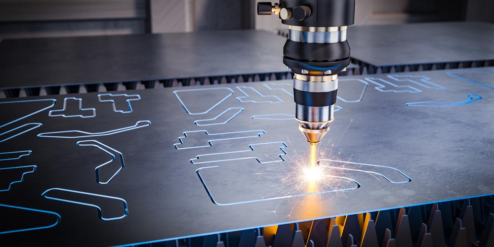
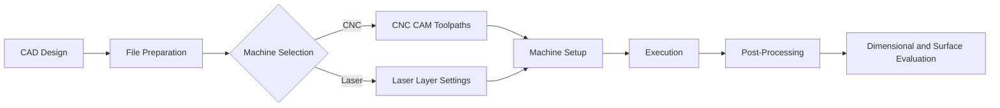
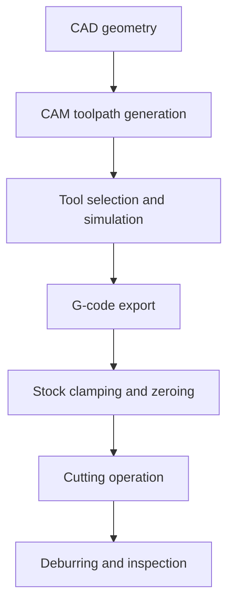

# Day 5 — Digital Fabrication I: CNC and Laser Cutting

## Objective
This session introduced two foundational subtractive fabrication methods, CNC machining and laser cutting, with emphasis on process selection, file preparation, parameter control, and safe execution. The objective was not simply to operate machines, but to develop the engineering judgment required to translate a design intent into a manufacturable artifact while anticipating limitations in geometry, tolerance, and material response.

By the end of the activity, the learner should be able to:

- distinguish CNC machining from laser cutting in terms of mechanism, geometry, and workflow;
- prepare fabrication-ready files with correct units, closed paths, and layer separation;
- select process parameters appropriate to the material and operation;
- apply safety controls before, during, and after machine operation;
- evaluate the output using measurable criteria rather than visual impression alone.

## Introduction
Digital fabrication converts digital geometry into physical form through controlled machine action. In this session, CNC machining and laser cutting were treated as complementary but fundamentally different processes. CNC machining removes material mechanically with a rotating cutter, whereas laser cutting removes material thermally through a focused beam. Both are subtractive, yet each imposes different constraints on thickness, kerf, surface finish, and toolpath planning.

The key technical idea is that fabrication quality is determined upstream. If the CAD geometry, file export, and process parameters are incorrect, the machine will reproduce those errors with high fidelity. For that reason, digital fabrication must be understood as a chain of decisions rather than a single machine action.

<figure markdown>

<figcaption>Laser cutting as a thermally driven subtractive process, suitable for sheet-based fabrication and engraving.</figcaption>
</figure>

## CNC and Laser Cutting: A Comparative View
Although both methods are subtractive, they differ in physical principle and operational logic.

| Aspect | CNC Machining | Laser Cutting |
| --- | --- | --- |
| Material removal | Mechanical cutting by rotating tool | Thermal ablation by focused beam |
| Typical geometry | 2.5D profiles, pockets, drilling, engraving | 2D contours, engraving, scoring |
| Critical parameters | Feed rate, spindle speed, depth of cut, tool diameter | Power, speed, focus, number of passes |
| Main constraints | Tool deflection, workholding, collision risk | Kerf, heat-affected zone, ventilation, flare risk |
| Best suited materials | Wood, plastics, soft metals, composites depending on setup | Plywood, acrylic, cardboard, leather, paper |
| Planning emphasis | Toolpath strategy and fixturing | Vector integrity, layer control, and kerf compensation |

The distinction matters because the same geometry may require different preparation depending on the machine. A sharp internal corner, for example, is not a problem for a vector file itself, but it becomes a machining constraint in CNC and a kerf-related tolerance issue in laser cutting.

## Workflow Diagram
The fabrication workflow can be described as a controlled sequence from design to verification.



This sequence is important because mistakes accumulate. A poor file export cannot be corrected by the machine, and an unsafe setup cannot be compensated for by parameter adjustments during execution.

## CNC Machining Principles
CNC machining is a subtractive process in which a rotating tool removes material according to G-code instructions. The cutter follows a toolpath generated in CAM software, and the quality of the cut depends on the interaction between feed rate, spindle speed, tool geometry, and the rigidity of the setup.

The process is typically organized into profile cutting, pocketing, drilling, and engraving. Each operation uses a different toolpath because the machine must control the cutter depth and lateral motion differently for each geometry. Workholding is equally important: if the stock moves during cutting, dimensional error and tool breakage become likely.

### CNC workflow



## Laser Cutting Principles
Laser cutting uses concentrated optical energy to vaporize or melt material along a programmed path. The beam is delivered through a controlled optical system and focused to a small spot at the material surface. Compared with CNC machining, the laser cutter does not apply mechanical force to the stock, which makes it efficient for thin sheet materials and detailed planar work.

The main parameters are power, speed, focus, and the number of passes. Higher power or lower speed increases energy density, but excessive energy causes charring, melt residue, or edge degradation. Correct focus is also essential because beam concentration determines kerf width and edge quality.

## Machine and Material Considerations
Process selection depends on the part geometry and the material response.

### Suitable materials

| Material | CNC suitability | Laser suitability | Notes |
| --- | --- | --- | --- |
| Plywood | Good | Good | Common for both processes; requires attention to charring in laser cutting |
| Acrylic | Good | Good | Laser cutting produces clean edges when parameters are controlled |
| Cardboard | Good for trials | Good | Useful for rapid prototyping and fit tests |
| Soft metals | Possible with proper tooling | Generally unsuitable in lab laser systems | CNC is preferred for mechanical removal |

### Design implications

- Sheet materials favor 2D or 2.5D workflows because their thickness is constant and predictable.
- Solid stock and thicker materials demand stronger fixturing and more conservative cutting parameters.
- Press-fit assemblies require kerf compensation so that joints assemble with the intended interference or clearance.

## File Preparation and Parameter Selection
File preparation is the highest-leverage quality control step in both workflows. For laser cutting, vector geometry should be closed, scaled correctly, and separated by operation. For CNC machining, CAM toolpaths should define the cutter, step-down, safe Z height, feed rate, spindle speed, and tabs where appropriate.

### File preparation rules

| Workflow | Required file logic | Typical failure mode |
| --- | --- | --- |
| Laser cutting | Closed vector paths, separate engraving and cutting layers, correct units | Duplicate lines, open contours, incorrect power assignment |
| CNC machining | CAM-generated G-code with tool selection and simulation | Collision risk, wrong depth, poor surface finish |

### Example process order

```text
CAD geometry -> File cleanup -> Process assignment -> Parameter selection -> Machine setup -> Execution -> Inspection
```

This order should be followed consistently because it reflects how fabrication problems are actually prevented: by controlling the digital setup before the machine starts cutting.

## Safety and Material Constraints
Both CNC machining and laser cutting introduce hazards that must be controlled deliberately. CNC systems create mechanical risks from rotating tools, moving axes, and flying chips. Laser cutters create optical, thermal, electrical, and fume hazards. In both cases, the operator must understand the machine before starting the job.

!!! warning "Critical safety rule"
    Stop the job immediately if flames persist, smoke extraction fails, the material behaves unexpectedly, or any abnormal noise or vibration appears.

### Mandatory controls

1. Verify that the material is approved for the intended process.
2. Keep ventilation or exhaust active throughout laser operation.
3. Secure stock firmly before CNC machining.
4. Confirm that the cutter or beam path is clear of clamps and fixtures.
5. Never leave an active machine unattended.
6. Record parameters and outcomes for traceability and future tuning.

### Material caution

Laser cutting should not be used on unknown plastics or chlorine-bearing materials, because these can release hazardous fumes and damage machine optics. CNC machining should be approached conservatively on brittle or thin stock, where tool load and workholding become critical.

## Results and Observations
The practical outcome of the session was a deeper understanding of how machine behavior reflects upstream decisions in design and setup. The most consistent results were obtained when the file was clean, the material was appropriate, and the machine settings matched the intended operation.

Observed outcomes included:

- cleaner engraving when the beam energy or cutter engagement was limited to the intended surface depth;
- better dimensional accuracy when kerf compensation and tool offsets were considered before fabrication;
- fewer failures when the workflow separated planning, setup, execution, and inspection into distinct steps;
- improved confidence in machine operation after explicitly comparing CNC and laser constraints.

The session reinforced that process quality is not a matter of machine use alone. It depends on selecting the correct method for the task and controlling the material-machine interaction with engineering discipline.

## Learning Outcomes
The session produced the following outcomes:

1. CNC machining and laser cutting were distinguished as separate subtractive systems with different planning requirements.
2. Kerf, feed rate, spindle speed, power, and focus were understood as controllable variables that directly affect output quality.
3. The importance of clean vector geometry, closed paths, and correct layer separation became explicit.
4. Safety procedures were recognized as part of fabrication competence rather than a separate administrative step.
5. Workflow sequencing was shown to affect both repeatability and final part quality.

!!! warning "The main practical challenge was accessing the UNIPOD Lab."
    We were unable to access the lab due to restrictions, which prevented us from completing the Digital Fabrication I (CNC and Laser Cutting) simple project.

## Conclusion
Day 5 established that digital fabrication is an integrated engineering workflow in which design quality, file preparation, machine setup, parameter selection, and safety practice are tightly coupled. CNC machining and laser cutting are both subtractive methods, but they solve different fabrication problems and therefore require different forms of technical reasoning.

The most important lesson was that effective fabrication depends on controlled decisions made before the machine starts. When geometry, parameters, and material constraints are aligned, the machine can reproduce the design accurately and safely.

## References

- Day 5 - Digital Fabrication I: CNC and Laser Cutting, ACEIoT Digital Fabrication Module: https://fablabrwanda.github.io/UR-ACEIoT/day5.html
- LightBurn Documentation: https://lightburnsoftware.com/pages/lightburn-documentation
- Fab Academy, Computer-Controlled Cutting: https://academy.cba.mit.edu/


