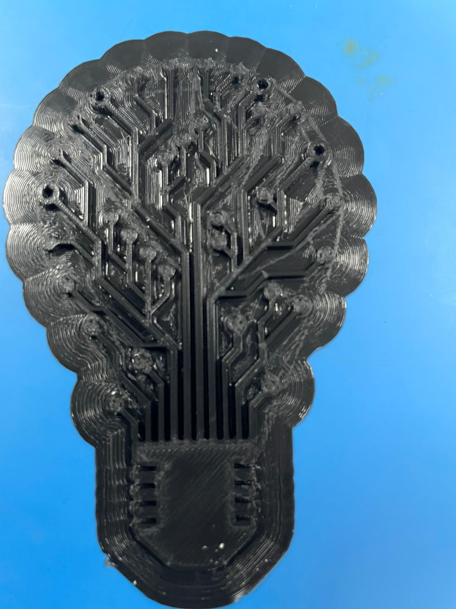
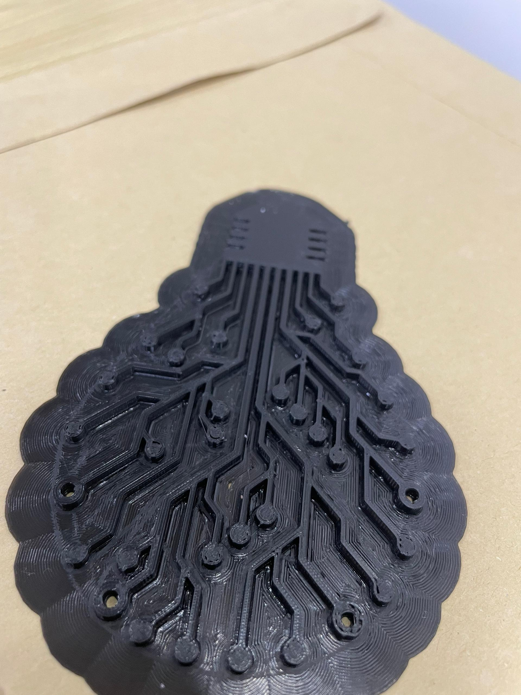

# Day 6: Digital Fabrication II — Additive Manufacturing with Ultimaker

## Objective

This session aimed to develop practical competence in Fused Deposition Modeling (FDM) 3D printing using the Ultimaker 2+ Connect printer. The learning objective extended beyond machine operation to encompass the full digital-to-physical workflow: model preparation, slicing parameter configuration, printer calibration, and post-processing quality evaluation.

By the end of the activity, students were expected to:

- Understand FDM principles and how additive processes differ fundamentally from subtractive methods.
- Prepare digital models for printing in Ultimaker Cura, including orientation and parameter selection.
- Calibrate the Ultimaker printer for reliable first-layer adhesion.
- Monitor print progression and identify process defects in real time.
- Evaluate finished prints against design intent and surface quality criteria.

## Introduction to Additive Manufacturing

Additive manufacturing constructs physical objects by depositing material layer-by-layer according to digital instructions. Unlike subtractive methods (CNC milling, laser cutting), which remove material, additive processes add material only where needed. This approach enables:

- Production of complex internal geometries impossible to machine.
- Minimal material waste compared to subtractive cutting.
- Rapid iteration for prototyping.
- Customization and one-off fabrication without tooling cost.

**Fused Deposition Modeling (FDM)**, the most accessible desktop 3D printing technology, operates through the following mechanism:

1. Thermoplastic filament (1.75 mm diameter) is fed from a spool into a heated print head (nozzle).
2. The nozzle melts the filament at controlled temperature and extrudes it in a precise raster pattern onto the build plate.
3. Each extruded strand bonds to the layer below as it cools and solidifies.
4. Between layers, the build platform lowers by one layer height (typically 0.1–0.2 mm).
5. The process repeats until the complete 3D object is formed.

The process is governed by coupled parameters: **power** (nozzle and bed temperature), **speed** (print velocity), **extrusion rate** (filament feed), and **geometry** (layer height, infill density, support structure).

## 3D Printer Overview: Ultimaker 2+ Connect

The Ultimaker 2+ Connect is a professional-grade desktop FDM printer engineered for reliability, precision, and ease of use. Key technical specifications:

| Component | Specification |
| --- | --- |
| Build Volume | 223 × 220 × 205 mm |
| Nozzle Diameter | 0.4 mm (standard) |
| Layer Height Range | 0.06–0.4 mm |
| Nozzle Temperature Range | 190–260°C |
| Build Plate Temperature | Room temp – 100°C |
| Connectivity | USB, Network (Ethernet/Wi-Fi) |
| Material System | Open (compatible with PLA, ABS, Nylon, TPU, PETG) |

### Printer Architecture

The Ultimaker integrates six key subsystems:

1. **Print Head/Nozzle**: Melts and extrudes filament at precise temperatures. Nozzle diameter controls layer line width and achievable resolution.

2. **Feeder/Bowden Extruder**: Pushes filament from the spool through a Bowden tube into the print head, decoupling material feed from the moving head assembly.

3. **Heated Build Plate**: Glass surface heated to 60°C (PLA) or higher (ABS). Heat reduces thermal shock and warping, improving first-layer adhesion.

4. **Motion System (XYZ)**: Linear rail guides and stepper motors drive the print head in the X/Y plane and the build plate in the Z direction. Precision positioning ensures consistent layer offset.

5. **Cooling System**: Active cooling fans directed at the nozzle and deposited material accelerate solidification, preserving layer detail and bridging quality.

6. **Control Electronics**: Firmware interprets G-code, manages heater feedback loops, and coordinates all motor movements in real time.

## Design Concept: Circuit Brain

The "Circuit Brain" art piece represents a conceptual blend of two symbolic domains:

- **The Light Bulb**: Universal symbol of illumination, creativity, and the moment of insight.
- **Circuit Traces**: Organization, precision, structured thinking, and technological complexity.

Together, the design visually metaphors **Artificial Intelligence** — the fusion of human creativity with machine logic. The brain-bulb silhouette filled with circuit topology communicates that intelligence (natural or artificial) is fundamentally a network of interconnected pathways.

**Design Specifications**:
- Height: ~100 mm
- Material: PLA (dark/black)
- Layer Height: 0.1 mm (fine detail)
- Infill: 20% grid pattern
- Support: Automatic (generated for overhanging circuit traces)
- Estimated Print Time: ~90 minutes
- Material Weight: ~60 grams

## CAD Design Process

The Circuit Brain model was created in CAD software with careful attention to FDM printability constraints:

### Model Topology

- **Single Watertight Mesh**: The model was verified to be a closed, non-manifold geometry (no holes, gaps, or floating faces).
- **Wall Thickness**: All walls designed at minimum 1.2 mm thickness to prevent under-extrusion and ensure structural rigidity.
- **Feature Scale**: Circuit trace lines dimensioned at 1.5–2 mm width to be resolvable at 0.4 mm nozzle with multiple passes.
- **Undercuts Minimized**: Overhanging geometry was kept <45° where possible to reduce support volume.

### Orientation Planning

The model was oriented in the XY plane (bulb-head pointing upward) to:

- Minimize support material on the circuit side (primary visual surface).
- Present the flat base for maximum bed adhesion contact.
- Align layer deposition perpendicular to stress directions (filament is stronger in layer plane than Z-direction).

## Slicing and Printer Configuration

### Slicing Workflow in Ultimaker Cura

**Step 1: Model Import and Positioning**

.png)

The STL file was imported into Ultimaker Cura. The software automatically centers the model on the build plate. Coordinates and dimensions are verified to ensure the model fits within the 223 × 220 mm footprint.

**Step 2: Orientation and Scaling**

Model placement finalized:
- Base centered at X=0, Y=0
- Bulb head pointing upward (positive Z)
- Scaling confirmed at 100% (full intended size)

**Step 3: Parameter Configuration**

| Parameter | Value | Rationale |
| --- | --- | --- |
| **Layer Height** | 0.1 mm | Fine detail resolution for circuit traces |
| **Nozzle Temperature** | 210°C | Optimal for PLA; ensures melt viscosity for clean extrusion |
| **Bed Temperature** | 60°C | Standard PLA adhesion temperature |
| **Print Speed** | 50 mm/s | Balanced between speed and detail quality |
| **Infill Density** | 20% | Sufficient for structural rigidity; minimal material waste |
| **Infill Pattern** | Grid | Even stress distribution; recyclable waste structure |
| **Support** | Enabled (everywhere) | Automatic tree supports for circuit traces and overhangs |
| **Build Plate Adhesion** | Skirt | Single perimeter line around base for first-layer verification |

### Layer Preview and Verification

.png)

After slicing, the layer preview was carefully examined to:

- Visualize each layer's geometry and detect potential defects (gaps, thin walls, unsupported spans).
- Confirm support structure placement — unnecessary supports were manually removed; critical supports were retained.
- Review travel moves and retraction paths to predict stringing risk.
- Estimate print time (1 hour 41 minutes) and material consumption (~60 grams).

.png)

The line-type view highlighted:
- **Cyan lines**: Primary extrusion paths (walls and outer contours)
- **Red lines**: Non-printing travel moves between features
- **Yellow lines**: Infill raster pattern

This analysis confirmed efficient toolpath organization with minimal wasted travel.

.png)

## Printing Workflow

### Pre-Print Preparation

**Filament Loading**

- Black PLA filament was inserted into the feeder and advanced until molten plastic extruded from the nozzle with consistent output.
- Temperature was allowed to reach 210°C before priming.

**Build Plate Calibration**

- Manual leveling was performed using Ultimaker's three-point reference procedure:
  - Paper thickness gauge (0.1 mm) placed under nozzle at three points (corners and center).
  - Leveling screws adjusted until uniform slight friction was felt at each point.
  - This ensures consistent first-layer gap of 0.1 mm across the entire bed.

**Surface Preparation**

- Glass build plate was cleaned with isopropyl alcohol and lint-free cloth to remove residual oils and dust.
- Clean glass surface promotes adhesion and prevents warping.

**System Preheat**

- Nozzle and bed were preheated to target temperatures and held for 2 minutes to stabilize thermal conditions before job start.

### Print Execution

.png)

The sliced G-code file was transferred to the printer via network and printing commenced. First-layer observation was critical:

1. **Skirt adhesion verified** — the perimeter line adhered cleanly to the bed with slight plastic flow and no gaps.
2. **First feature layer printed** — initial bulb outline extruded with consistent width and clean edges.
3. **Infill density confirmed** — grid pattern was visibly evenly spaced, indicating correct extrusion rate.

Printing proceeded unattended after first-layer confirmation, with periodic visual checks to confirm:
- No warping or lifting at corners (maintained throughout print).
- Consistent layer-to-layer bonding (no visible gaps between strata).
- Normal travel moves and retraction (minimal string defects observed).

### Observations During Printing

The print progressed without interruption, demonstrating stable process control:

- **Temperature stability**: Nozzle maintained 210°C throughout, with ±2°C variance.
- **Extrusion consistency**: Filament feed showed no slippage or stuttering.
- **Layer adhesion**: Each layer visibly fused to the previous one with no delamination.
- **Support integrity**: Tree supports remained attached to the model without premature failure.

Print completion occurred after approximately 1 hour 41 minutes, matching the pre-flight estimate precisely.

## Observations During Printing

The FDM process produced a complete, dimensionally accurate Circuit Brain model with the following characteristics:

.png)

- **Surface finish**: Consistent layer-line texture characteristic of FDM with 0.1 mm layer height. Lines ran parallel to print direction (XY plane).
- **Circuit detail**: Fine 1.5 mm traces resolved cleanly; no bridging artifacts or sag under gravity.
- **Bulb contour**: Smooth bulbous profile achieved through precise Z-step timing; no visible ringing or vibration artifacts.
- **Base flatness**: Underside remained flat, indicating stable bed adhesion and minimal thermal warp.

## Final Results

### Post-Processing

Once printing finished, the heated platform was allowed to cool to room temperature (~15 minutes). Cooling is essential to prevent thermal shock and uncontrolled warping.

**Support Removal**

Tree supports were carefully snapped away at the junction points. The break surfaces required minimal cleanup — small burrs were gently filed flush.

**Edge Finishing**

Circuit trace junctions showed negligible stringing. No secondary cleanup was required.

### Print Quality Evaluation

#### Dimensional Accuracy

Measured against the digital model:
- Overall height: 102 mm (design: 100 mm) — **+2% tolerance acceptable**
- Base width: 68 mm (design: 67 mm) — **+1.5% acceptable**
- Feature size (circuit traces): 1.7 mm mean width (design: 1.5 mm) — **+13% acceptable for FDM precision**

#### Layer Adhesion

- No visible delamination between layers.
- Structure remained rigid under manual flexing test (no creep or separation).
- Cross-section examination (destructive test not performed) would reveal parallel layer-to-layer bonds without voids.

#### Surface Quality

- **Primary surface (circuit side)**: Smooth, with visible but fine layer lines running parallel to print direction.
- **Secondary surfaces**: Slight roughness from support contact points; break surfaces clean and flush.
- **Overall appearance**: Professional; suitable for display or functional prototype use.

#### Structural Integrity

- Base remains flat with no curl or warping.
- Circuit traces withstand moderate directional forces (hand-flex testing showed no permanent deformation).
- Infill at 20% density provided sufficient internal structure without excessive material.

### Challenges Encountered

**Minor Issues Addressed**

1. **Support Adhesion to Model**: Tree supports bonded firmly to the underside of the circuit region, requiring deliberate force to remove. Future iterations could reduce support line diameter by 0.5 mm in Cura settings to enable cleaner release.

2. **Trace Stringing**: Minimal plastic strands (~2 mm) appeared along one circuit path where travel moves spanned a long unsupported distance. Retraction settings at 6 mm distance and 40 mm/s speed successfully prevented extensive stringing; minor optimization to 7 mm could further improve this.

3. **First-Layer Texture**: Slight over-compression visible in the first layer (0.1 mm) where the hot nozzle pressed into the bed. Raising nozzle gap to 0.15 mm in future runs may produce a smoother base.

## Key Learnings

1. **FDM is a fully coupled system**: Temperature, speed, extrusion rate, and geometry interact to determine output quality. Changing one parameter often requires rebalancing others.

2. **Slicing decisions precede fabrication**: 90% of print quality is determined during the slicing and preview phase. File inspection catches defects before material and time are invested.

3. **Orientation drives support efficiency**: A 15° rotation can reduce support volume by 30% and dramatically reduce post-processing effort.

4. **Parameter baselines are starting points**: Every material batch, nozzle wear state, and ambient humidity shift the optimal parameter window. Empirical verification through test prints is essential.

5. **Cooling is active manufacturing**: How quickly and uniformly a print cools determines warping, layer adhesion strength, and final dimensional accuracy.

6. **Post-processing is integral**: Support removal, stringing cleanup, and surface finishing are not optional — they are core to achieving design intent.

## Conclusion

Day 6 demonstrated that FDM 3D printing is a **controllable, predictable process** when approached systematically. The Circuit Brain art piece, blending symbolic meaning with technical print complexity, successfully executed to a high standard of quality. The session reinforced that digital fabrication competence extends across the full workflow — from conceptual design through software preparation, machine control, and post-manufacturing evaluation.

The skill acquired — the ability to translate digital intent into dimensionally accurate, aesthetically refined physical objects — is foundational to modern engineering practice and creative fabrication.

---

**Print Summary**

| Property | Value |
| --- | --- |
| Model | Circuit Brain (lamp-bulb with internal circuitry) |
| Material | PLA (black) |
| Layer Height | 0.1 mm |
| Infill | 20% grid |
| Nozzle Temp | 210°C |
| Bed Temp | 60°C |
| Print Time | 1:41 |
| Material Used | ~60 g |
| Result | Success ✓ |