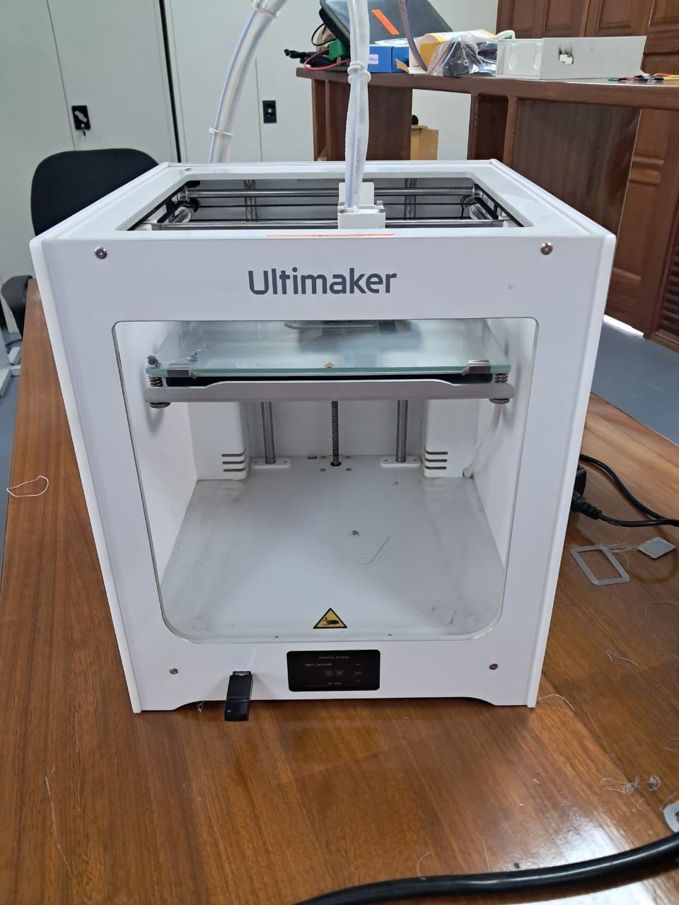
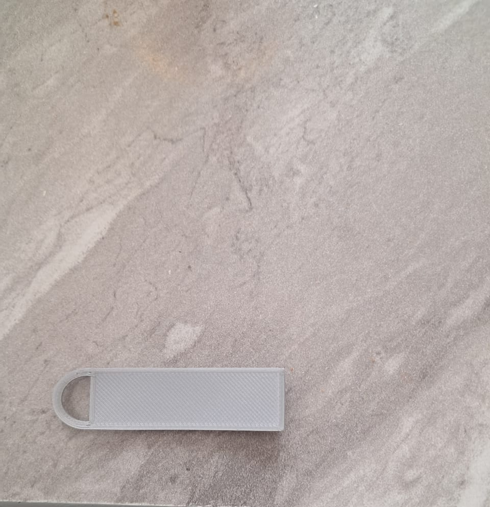

# 6. Activity of Day 6

# Ultimaker 3D Printer Operation

## Overview
This documentation covers the operation of the **Ultimaker** printer, which uses **Fused Deposition Modeling (FDM)** technology. In this process, the printer builds objects layer-by-layer by melting and extruding plastic filaments.

## 1. Machine & Materials
The Ultimaker is a desktop FDM printer known for reliability and precision. Before printing, it is critical to select the right material for the job.

| Material | Properties | Best Application |
| :--- | :--- | :--- |
| **PLA** | Biodegradable, easy to print. | General prototyping, visual models. |
| **ABS** | Strong, temperature-resistant. | Functional parts, mechanical gears. |
| **PETG** | Impact-resistant, combines PLA ease with ABS strength. | Snap-fits, protective cases. |
| **TPU** | Flexible and rubber-like. | Phone cases, seals, gaskets. |

---

## 2. The Printing Workflow

### Phase A: Slicing (Ultimaker Cura)
Before the printer can move, the digital 3D model (STL/OBJ) must be "sliced" into G-code instructions.

!!! info "Key Slicing Settings"
    * **Layer Height:** Determines resolution. Lower (e.g., 0.1mm) is smoother but slower.
    * **Infill Density:** Controls internal strength. 20% is standard; 100% is solid.
    * **Supports:** Essential for overhangs greater than 45°.

### Phase B: Printer Setup

=== "1. Load Filament"
    Feed the filament into the extruder path. Ensure the material matches the Cura profile!

=== "2. Level Build Plate"
    **Critical Step:** The build plate must be perfectly level to ensure the first layer adheres correctly. Use the manual leveling screws or auto-calibration if available.

=== "3. Clean Surface"
    Wipe the glass plate with isopropyl alcohol to remove oils (fingerprints) that cause warping.

---

## 3. Operations & Troubleshooting

### Monitoring the Print
!!! warning "Watch the First Layer"
    Always monitor the first few layers. Most failures (like detachment) happen here. If the nozzle is too high, the plastic won't stick; too low, and it will block flow.

### Common Issues & Fixes

| Issue | Symptom | Solution |
| :--- | :--- | :--- |
| **Warping** | Corners lifting off the plate. | Clean the bed, use glue stick, or increase bed temperature. |
| **Stringing** | Fine plastic hairs between parts. | Lower nozzle temperature or increase retraction settings. |
| **Under-extrusion** | Gaps or thin layers. | Check for nozzle clogs or filament tangles. |

---

## 4. Safety Guidelines
Operating a 3D printer involves high heat and moving parts.

* **Heat Hazard:** The nozzle reaches 200°C+ and the bed 60°C+. **Do not touch** these components during operation.
* **Ventilation:** Ensure the room is well-ventilated, especially when printing materials like ABS that release fumes.
* **Supervision:** Never leave the printer unattended for long periods.

## 5. Project Showcase
*Below is the bracket I prepared using this workflow:*

*Figure 1: Printing machine.*

*Figure 1: My Printed .*